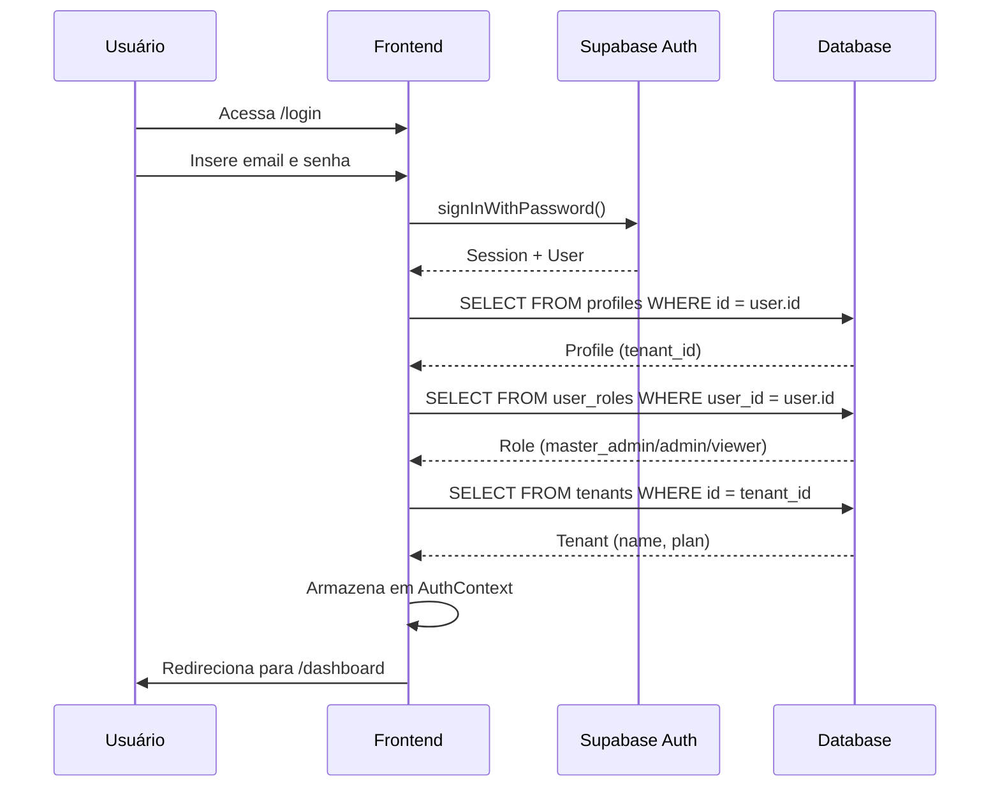
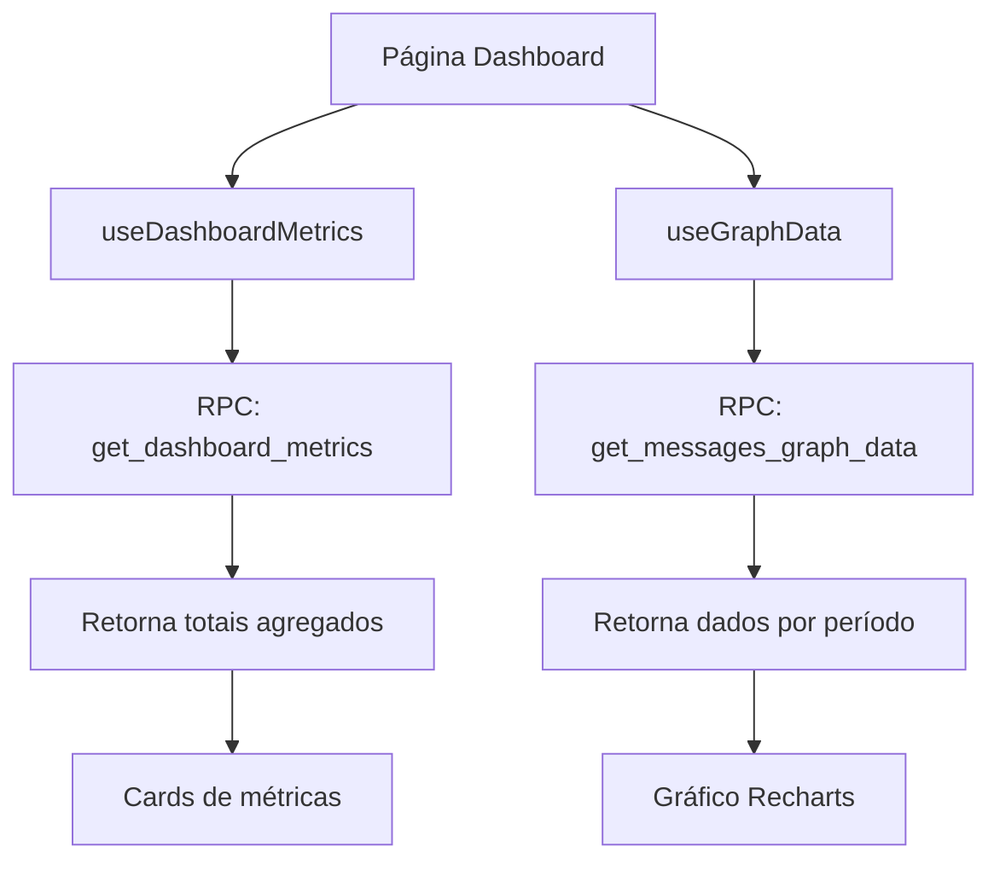
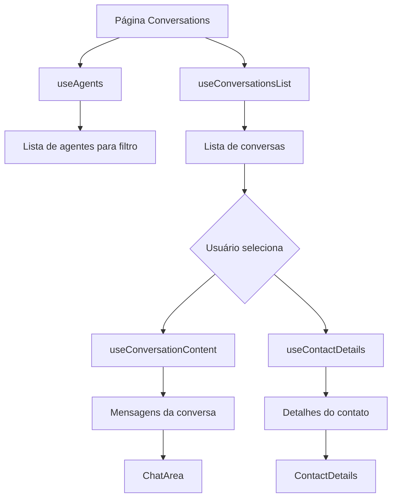
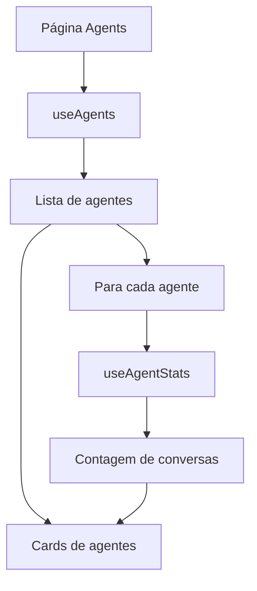

# Inguz.Tech - Lógica de Funcionamento

Documentação completa da arquitetura e lógica de funcionamento do sistema.

## 🏗️ Arquitetura Geral

```
┌─────────────────────────────────────────────────────────────────┐
│                        FRONTEND (React)                         │
├─────────────────────────────────────────────────────────────────┤
│  Pages          │  Components        │  Hooks                   │
│  ├─ Landing     │  ├─ Layout         │  ├─ useAgents            │
│  ├─ Login       │  ├─ Conversations  │  ├─ useAgentStats        │
│  ├─ Signup      │  ├─ Settings       │  ├─ useContactDetails    │
│  ├─ Dashboard   │  ├─ Analytics      │  ├─ useConversationsList │
│  ├─ Conversations│ └─ UI (shadcn)    │  ├─ useConversationContent│
│  ├─ Agents      │                    │  ├─ useDashboardMetrics  │
│  └─ Settings    │                    │  └─ useGraphData         │
├─────────────────┴────────────────────┴──────────────────────────┤
│                     State Management                             │
│  ├─ AuthContext (User, Profile, Tenant, Role)                   │
│  └─ TanStack Query (Server State Cache)                         │
└─────────────────────────────────────────────────────────────────┘
                              │
                              ▼
┌─────────────────────────────────────────────────────────────────┐
│                      SUPABASE (Backend)                          │
├─────────────────────────────────────────────────────────────────┤
│  Auth            │  Database (PostgreSQL)  │  RPC Functions     │
│  ├─ Sign Up      │  ├─ tenants             │  ├─ get_dashboard_ │
│  ├─ Sign In      │  ├─ profiles            │  │   metrics       │
│  ├─ Sign Out     │  ├─ user_roles          │  ├─ get_messages_  │
│  └─ Session      │  ├─ agents              │  │   graph_data    │
│                  │  ├─ contacts            │  └─ has_role       │
│                  │  ├─ conversations       │                    │
│                  │  └─ messages            │                    │
├──────────────────┴─────────────────────────┴────────────────────┤
│                    Row Level Security (RLS)                      │
│  └─ Isolamento por tenant_id em todas as tabelas                │
└─────────────────────────────────────────────────────────────────┘
                              │
                              ▼
┌─────────────────────────────────────────────────────────────────┐
│                    WHATSAPP API (External)                       │
│  └─ Integração externa para envio/recebimento de mensagens      │
└─────────────────────────────────────────────────────────────────┘
```

---

## 🔐 Fluxo de Autenticação



### Detalhamento

1. **Login**: Usuário submete credenciais
2. **Autenticação**: Supabase Auth valida e retorna session
3. **Perfil**: Sistema busca dados do profile
4. **Role**: Sistema busca role do usuário (tabela separada por segurança)
5. **Tenant**: Sistema busca dados do tenant
6. **Contexto**: Todos os dados são armazenados no AuthContext
7. **Redirecionamento**: Usuário é direcionado ao dashboard

### Estrutura do AuthContext

```typescript
interface AuthContextType {
  user: SupabaseUser | null;      // Dados do auth.users
  session: Session | null;         // Sessão ativa
  profile: Profile | null;         // Perfil (full_name, tenant_id)
  tenant: Tenant | null;           // Tenant (name, plan)
  role: AppRole | null;            // Role (master_admin/admin/viewer)
  isLoading: boolean;              // Estado de carregamento
  login: (email, password) => Promise<{ error }>;
  signup: (email, password, name) => Promise<{ error }>;
  logout: () => Promise<void>;
}
```

---

## 🏢 Isolamento Multi-Tenant

### Princípios

1. **Filtro Obrigatório**: Todas as queries incluem `tenant_id`
2. **RLS no Banco**: Policies garantem isolamento mesmo se frontend falhar
3. **Contexto Automático**: Hooks usam `profile.tenant_id` automaticamente

### Fluxo de Dados

```
┌──────────────┐     ┌──────────────┐     ┌──────────────┐
│   Frontend   │ --> │    Query     │ --> │   Database   │
│ (tenant_id)  │     │ (filtro)     │     │   (RLS)      │
└──────────────┘     └──────────────┘     └──────────────┘
       │                    │                    │
       │    tenant_id       │   tenant_id =      │   RLS Policy
       │    do AuthContext  │   :tenant_id       │   verifica
       ▼                    ▼                    ▼
   Automático           Adicionado           Dupla proteção
```

### Exemplo de Query

```typescript
// Hook sempre inclui tenant_id
const { data } = await supabase
  .from('agents')
  .select('*')
  .eq('tenant_id', profile.tenant_id);

// RLS policy também valida
CREATE POLICY "tenant_isolation" ON agents
  FOR SELECT USING (
    tenant_id = get_user_tenant_id(auth.uid())
  );
```

---

## 📊 Fluxos Principais

### Dashboard



**Métricas exibidas:**
- Total de conversas
- Total de mensagens
- Total de contatos
- Mensagens enviadas vs recebidas

---

### Conversas



**Componentes:**
- `ConversationList`: Lista lateral de conversas com filtros
- `ChatArea`: Área de visualização de mensagens
- `ContactDetails`: Painel com informações do contato

**Filtros disponíveis:**
- Por agente
- Por range de data
- Busca por texto

---

### Agentes



**Informações exibidas:**
- Nome e descrição do agente
- Número WhatsApp
- Total de conversas

---

## 🪝 Hooks e Responsabilidades

| Hook | Tabelas/RPC | Função |
|------|-------------|--------|
| `useAgents` | `agents` | Lista agentes do tenant |
| `useAgentStats` | `conversations` | Conta conversas por agente |
| `useContactDetails` | `contacts` | Busca detalhes de um contato |
| `useConversationContent` | `messages` | Lista mensagens de uma conversa |
| `useConversationsList` | `conversations`, `contacts`, `messages` | Lista conversas com filtros |
| `useDashboardMetrics` | RPC `get_dashboard_metrics` | Métricas agregadas |
| `useGraphData` | RPC `get_messages_graph_data` | Dados temporais para gráficos |

### Padrão de Implementação

```typescript
export function useExample(tenantId: string | undefined) {
  return useQuery({
    queryKey: ['example', tenantId],
    queryFn: async () => {
      if (!tenantId) return [];
      
      const { data, error } = await supabase
        .from('table')
        .select('*')
        .eq('tenant_id', tenantId);
      
      if (error) throw error;
      return data;
    },
    enabled: !!tenantId,
    staleTime: 5 * 60 * 1000, // 5 minutos
  });
}
```

---

## 👥 Permissões por Role

### Matriz de Permissões

| Funcionalidade | master_admin | admin | viewer |
|----------------|:------------:|:-----:|:------:|
| **Dashboard** |
| Ver métricas | ✅ | ✅ | ✅ |
| Ver gráficos | ✅ | ✅ | ✅ |
| **Conversas** |
| Ver lista | ✅ | ✅ | ✅ |
| Ver mensagens | ✅ | ✅ | ✅ |
| Ver detalhes contato | ✅ | ✅ | ✅ |
| **Agentes** |
| Ver agentes | ✅ | ✅ | ✅ |
| Criar agente | ✅ | ✅ | ❌ |
| Editar agente | ✅ | ✅ | ❌ |
| Deletar agente | ✅ | ✅ | ❌ |
| **Usuários** |
| Ver usuários | ✅ | ✅ | ❌ |
| Criar usuário | ✅ | ✅ | ❌ |
| Editar usuário | ✅ | ✅ | ❌ |
| Deletar usuário | ✅ | ✅ | ❌ |
| **Tenants** |
| Ver tenants | ✅ | ❌ | ❌ |
| Criar tenant | ✅ | ❌ | ❌ |
| Editar tenant | ✅ | ❌ | ❌ |
| Deletar tenant | ✅ | ❌ | ❌ |

### Verificação no Frontend

```typescript
const { role } = useAuth();

// Verificação simples
const canEdit = role === 'master_admin' || role === 'admin';

// Componente condicional
{canEdit && <EditButton />}
```

### Verificação no Backend (RLS)

```sql
CREATE POLICY "admin_insert" ON agents
  FOR INSERT
  WITH CHECK (
    has_role(auth.uid(), 'admin') OR 
    has_role(auth.uid(), 'master_admin')
  );
```

---

## ⚡ Performance

### Otimizações Implementadas

| Técnica | Implementação |
|---------|---------------|
| **Cache de queries** | TanStack Query com staleTime de 5 minutos |
| **Retries limitados** | Máximo 1 retry em caso de erro |
| **Lazy loading** | Componentes carregados sob demanda |
| **Skeleton states** | Loading visual durante carregamento |
| **Filtros otimizados** | Debounce em buscas e filtros |

### Melhorias Futuras

- [ ] Virtualização de listas longas
- [ ] Prefetch de dados
- [ ] Service Workers para cache offline
- [ ] Paginação infinita

---

## 🔄 Fluxo de Dados

```
┌─────────────────────────────────────────────────────────────────┐
│                         Camada de UI                            │
│   Pages → Components → Hooks                                    │
└─────────────────────────────────────────────────────────────────┘
                              │
                              ▼
┌─────────────────────────────────────────────────────────────────┐
│                      TanStack Query                             │
│   ├─ Cache de dados                                             │
│   ├─ Estados de loading/error                                   │
│   ├─ Refetch automático                                         │
│   └─ Invalidação de cache                                       │
└─────────────────────────────────────────────────────────────────┘
                              │
                              ▼
┌─────────────────────────────────────────────────────────────────┐
│                      Supabase Client                            │
│   ├─ Queries (.from().select())                                 │
│   ├─ RPC calls (.rpc())                                         │
│   └─ Auth (.auth.*)                                             │
└─────────────────────────────────────────────────────────────────┘
                              │
                              ▼
┌─────────────────────────────────────────────────────────────────┐
│                         PostgreSQL                               │
│   ├─ Tabelas com RLS                                            │
│   ├─ Funções RPC                                                │
│   └─ Triggers e constraints                                     │
└─────────────────────────────────────────────────────────────────┘
```

---

## 📱 Responsividade

### Layout de Conversas

**Desktop (≥768px):**
```
┌─────────┬─────────────────┬─────────┐
│  Lista  │     Chat        │ Detalhes│
│  (25%)  │     (50%)       │  (25%)  │
└─────────┴─────────────────┴─────────┘
```

**Mobile (<768px):**
```
┌─────────────────────────────────────┐
│         Vista Única                 │
│   (Lista / Chat / Detalhes)         │
│         com navegação               │
└─────────────────────────────────────┘
```

### Hook de Detecção

```typescript
const isMobile = useIsMobile(); // breakpoint: 768px
```

---

## 📅 Última Atualização

Documento gerado em: Janeiro 2026
